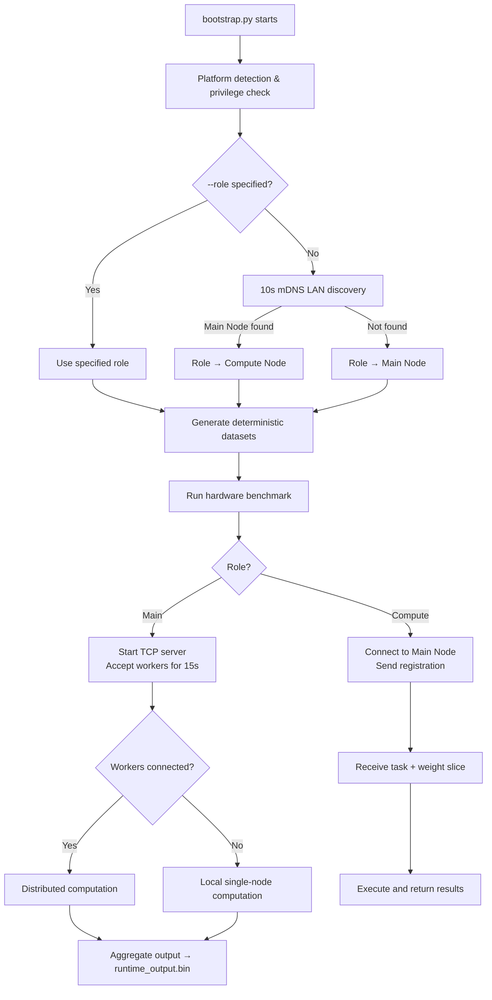

# SuperWeb Cluster

LAN-based distributed Conv2D computation cluster. Multiple machines auto-discover each other via mDNS, coordinate over TCP, collaboratively execute large-scale 2D convolution workloads, and aggregate results on the main node.

## Features

| Capability | Description |
|---|---|
| **Auto-Discovery** | Zero-configuration LAN networking via mDNS (DNS-SD) — no manual IP entry |
| **Hardware Benchmarking** | Automatic CPU / CUDA / Metal backend detection and performance ranking at startup |
| **GFLOPS-Aware Scheduling** | Workload allocation proportional to each node's measured compute throughput |
| **Distributed Conv2D** | Full weight tensor sliced along the `C_out` dimension and distributed to workers |
| **Deterministic Data** | Input feature maps generated with fixed-seed PRNG — byte-identical across all nodes |
| **Multi-Backend Support** | Native C++ CPU (multithreaded), CUDA GPU, and macOS Metal compute backends |
| **Result Aggregation** | Main node collects output slices from all workers and assembles the final output tensor |

## Architecture

```
┌──────────────────── LAN ────────────────────┐
│                                             │
│  ┌─────────────┐      ┌─────────────┐       │
│  │ Compute Node│      │ Compute Node│  ...  │
│  │ (Worker)    │      │ (Worker)    │       │
│  │             │      │             │       │
│  │ 1. Generate │      │ 1. Generate │       │
│  │    input.bin│      │    input.bin│       │
│  │ 2. Benchmark│      │ 2. Benchmark│       │
│  │ 3. Register │      │ 3. Register │       │
│  │    with Main│      │    with Main│       │
│  │ 4. Receive  │      │ 4. Receive  │       │
│  │    weight   │      │    weight   │       │
│  │    slice    │      │    slice    │       │
│  │ 5. Return   │      │ 5. Return   │       │
│  │    output   │      │    output   │       │
│  └──────┬──────┘      └──────┬──────┘       │
│         │     TCP:9800       │              │
│         └────────┬───────────┘              │
│                  │                          │
│          ┌───────▼───────┐                  │
│          │  Main Node    │                  │
│          │               │                  │
│          │ 1. Generate   │                  │
│          │    input +    │                  │
│          │    weight     │                  │
│          │ 2. Wait for   │                  │
│          │    workers    │                  │
│          │    (15s)      │                  │
│          │ 3. Allocate   │                  │
│          │    Cout slices│                  │
│          │    by GFLOPS  │                  │
│          │ 4. Distribute │                  │
│          │    weight +   │                  │
│          │    local work │                  │
│          │ 5. Aggregate  │                  │
│          │    all slices │                  │
│          └──────────────┘                  │
└─────────────────────────────────────────────┘
```

## Getting Started

### Prerequisites

- **Python 3.11+** (only the standard library is used — zero third-party dependencies)
- **Compiled C++ backend** (at least one required):
  - **Windows CPU**: Visual Studio 2022 + MSVC (`cl.exe`)
  - **CUDA GPU**: NVIDIA CUDA Toolkit (`nvcc`)
  - **macOS CPU/Metal**: Xcode Command Line Tools (`clang`)

### Build the Compute Backends

```bash
# Windows (CPU + CUDA)
Windows-build.bat

# macOS (CPU + Metal)
bash Macos-build.bat
```

### Start the Cluster

**Auto-discovery mode** (recommended) — run on each machine; the first becomes the Main Node, subsequent ones join as Compute Nodes:

```bash
python bootstrap.py
```

**Manual role assignment:**

```bash
# Force Main Node
python bootstrap.py --role main

# Force Compute Node, connecting to a specific main node
python bootstrap.py --role compute --main-addr 192.168.1.100

# Skip benchmark if result.json already exists
python bootstrap.py --skip-benchmark
```

### Run Individual Components

```bash
# Run hardware benchmark only
python compute_node/performance_metrics/benchmark.py

# Generate dataset only
python compute_node/dataset/generate.py --output-dir ./data --role main
```

## Startup Flow



## Data Flow

### Deterministic Data Generation

All nodes use the same xorshift32 PRNG with fixed seeds to generate input data, ensuring **byte-for-byte consistency**:

| Data | Seed | Generated By | Size (default 2048×2048) |
|---|---|---|---|
| `runtime_input.bin` | `0x123456789ABCDEF0` | Each node (locally) | 2048×2048×128×4 = **2 GB** |
| `runtime_weight.bin` | `0x0FEDCBA987654321` | **Main Node only** | 3×3×128×256×4 = **1.125 MB** |

### Cluster Communication Protocol

Communication uses a simple length-prefixed TCP message format: `[4B length][1B type][payload]`

| Message Type | Direction | Content |
|---|---|---|
| `REGISTER` | Compute → Main | Node name, GFLOPS, backend type |
| `TASK_ASSIGN` | Main → Compute | worker_id, output channel range, conv parameters |
| `WEIGHT_DATA` | Main → Compute | Weight slice along `C_out` dimension (binary) |
| `START` | Main → Compute | Begin computation signal |
| `TASK_DONE` | Compute → Main | Elapsed time, GFLOPS, checksum |
| `OUTPUT_DATA` | Compute → Main | Output slice (binary) |
| `ALL_DONE` | Main → Compute | Task complete, close connection |

### Workload Allocation

The Main Node distributes `C_out` ranges proportionally based on each node's GFLOPS:

```
Total C_out = 256
Node A (40 GFLOPS) → oc=[0, 128)     50%
Node B (30 GFLOPS) → oc=[128, 224)   37.5%
Main   (10 GFLOPS) → oc=[224, 256)   12.5%
```

## Default Convolution Dimensions

| Parameter | Benchmark (Test) | Runtime |
|---|---|---|
| Input size (H×W) | 256×256 | 2048×2048 |
| Input channels (C_in) | 32 | 128 |
| Output channels (C_out) | 64 | 256 |
| Kernel size (K) | 3×3 | 3×3 |
| Padding | 1 | 1 |

## Directory Structure

```
SuperWeb/
├── bootstrap.py                # Entry point: role detection → data gen → benchmark → runtime
├── config.py                   # Runtime config (ports, timeouts, multicast defaults)
├── constants.py                # Global constants (message types, service names)
├── supervisor.py               # Legacy startup coordinator (backward-compatible)
├── protocol.py                 # mDNS/DNS-SD packet construction and parsing
├── runtime_protocol.py         # Protobuf encode/decode (registration, heartbeat, client msgs)
├── logging_setup.py            # Logging configuration
├── trace_utils.py              # Function call tracing decorator
├── recovery.py                 # Fault recovery placeholder (not yet implemented)
│
├── common/                     # Shared modules
│   ├── cluster_protocol.py     #   TCP message protocol (length-prefixed frame format)
│   ├── types.py                #   Shared dataclasses (DiscoveryResult, HardwareProfile, etc.)
│   ├── hardware.py             #   Hardware info collection
│   ├── state.py                #   Runtime state enum
│   ├── messages.py             #   Message structures
│   └── errors.py               #   Custom exceptions
│
├── discovery/                  # Node discovery
│   ├── pairing.py              #   Discovery/announce flow orchestration
│   ├── multicast.py            #   mDNS multicast send/receive
│   └── fallback.py             #   Manual address input fallback
│
├── adapters/                   # Platform abstraction layer
│   ├── platform.py             #   OS/privilege detection
│   ├── network.py              #   Network utilities (local IP, MAC address)
│   ├── firewall/               #   Firewall rule management
│   ├── audit_log.py            #   Audit log placeholder
│   └── process.py              #   Process management placeholder
│
├── main_node/                  # Main node runtime
│   ├── runtime.py              #   TCP server, task orchestration, distributed execution
│   ├── dispatcher.py           #   Local/distributed task dispatch
│   ├── registry.py             #   Worker registry, GFLOPS-weighted slice allocation
│   ├── aggregator.py           #   Output slice aggregation (reassembly by C_out)
│   ├── heartbeat.py            #   Heartbeat management
│   └── handlers.py             #   Message handlers (placeholder)
│
├── compute_node/               # Compute node runtime
│   ├── runtime.py              #   Connect → Register → Receive weight → Compute → Return
│   ├── executor.py             #   Invoke compiled backend for convolution
│   ├── session.py              #   Protobuf TCP session management
│   ├── performance_summary.py  #   Benchmark result summary
│   ├── heartbeat.py            #   Heartbeat response
│   ├── handlers.py             #   Message handlers (placeholder)
│   │
│   ├── dataset/                #   Deterministic dataset generation
│   │   ├── generate.py         #     Data generation script
│   │   └── generated/          #     Generated .bin files (git-ignored)
│   │
│   └── performance_metrics/    #   Hardware benchmark workspace
│       ├── benchmark.py        #     Benchmark entry point
│       ├── models.py           #     BenchmarkSpec / TrialRecord dataclasses
│       ├── workloads.py        #     Test/runtime dimension definitions
│       ├── fmvm_dataset.py     #     PRNG-based dataset generator
│       ├── scoring.py          #     Performance scoring algorithm
│       ├── path_utils.py       #     Executable path utilities
│       ├── result.json         #     Benchmark report (git-ignored)
│       ├── backends/           #     Python backend adapters
│       │   ├── cpu_backend.py  #       CPU backend
│       │   ├── cuda_backend.py #       CUDA backend
│       │   └── metal_backend.py#       Metal backend
│       └── conv2d_runners/     #     Compiled native Conv2D executables
│           ├── cpu/            #       C++ CPU source & binaries
│           ├── cuda/           #       CUDA source & binaries
│           └── metal/          #       Metal source & binaries
│
├── standalone_model/           # Standalone network experiments (mDNS/TCP/ZMQ comparisons)
├── proto/                      # Protobuf protocol definition files
├── tests/                      # Unit tests
│
├── Windows-build.bat           # Windows build script (MSVC + CUDA)
└── Macos-build.bat             # macOS build script (Clang + Metal)
```

## Technical Notes

- **Pure Standard Library**: The core runtime depends only on the Python standard library (`socket`, `struct`, `threading`, `subprocess`, etc.) — no third-party packages required.
- **Hand-Written Protobuf**: `runtime_protocol.py` implements full protobuf wire-format encode/decode without the protobuf library.
- **Hand-Written mDNS**: `protocol.py` implements DNS-SD PTR/SRV/TXT/A record construction and parsing from scratch.
- **C++/CUDA Compute Backends**: Actual convolution is performed by compiled native executables. Python invokes them via `subprocess` and parses their JSON output.
- **Deterministic Data Consistency**: A fixed-seed xorshift32 PRNG guarantees all nodes generate identical input matrices, avoiding the need to transfer 2 GB over the network.

## License

For educational and research purposes only.
