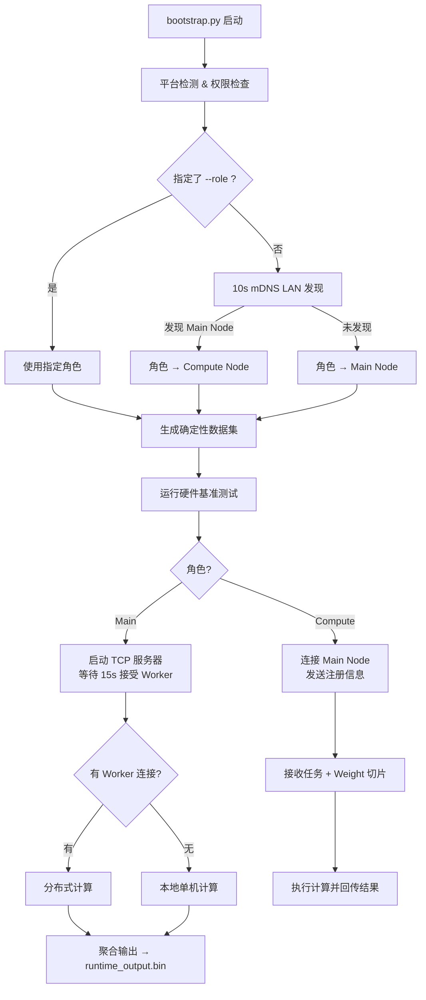

# SuperWeb Cluster

基于局域网的分布式 Conv2D 卷积计算集群。多台机器通过 mDNS 自动发现、TCP 协调，协同完成大规模 2D 卷积任务，并将计算结果聚合到主节点。

## 功能概览

| 能力 | 说明 |
|------|------|
| **自动发现** | 基于 mDNS (DNS-SD) 的零配置 LAN 组网，无需手动填写 IP |
| **硬件基准测试** | 启动时自动探测 CPU / CUDA / Metal 后端性能并排名 |
| **GFLOPS 感知调度** | 根据各节点跑分结果按算力比例分配工作量 |
| **分布式 Conv2D** | 将完整卷积核(weight)按输出通道 `C_out` 维度切片下发，各节点并行计算 |
| **确定性数据** | 输入特征图(input matrix)使用固定种子 PRNG 生成，所有节点结果逐字节一致 |
| **多后端支持** | 原生 C++ CPU (多线程)、CUDA GPU、macOS Metal 三套编译后端 |
| **结果聚合** | 主节点收集各节点输出切片，按 `C_out` 拼合为完整输出张量 |

## 系统架构

```
┌──────────────────── LAN ────────────────────┐
│                                             │
│  ┌─────────────┐      ┌─────────────┐       │
│  │ Compute Node│      │ Compute Node│  ...  │
│  │ (Worker)    │      │ (Worker)    │       │
│  │             │      │             │       │
│  │ 1.本地生成   │      │ 1.本地生成   │       │
│  │   input.bin │      │   input.bin │       │
│  │ 2.跑基准测试 │      │ 2.跑基准测试 │       │
│  │ 3.注册到Main │      │ 3.注册到Main │       │
│  │ 4.收weight  │      │ 4.收weight  │       │
│  │   切片并计算 │      │   切片并计算 │       │
│  │ 5.回传输出   │      │ 5.回传输出   │       │
│  └──────┬──────┘      └──────┬──────┘       │
│         │     TCP:9800       │              │
│         └────────┬───────────┘              │
│                  │                          │
│          ┌───────▼───────┐                  │
│          │  Main Node    │                  │
│          │               │                  │
│          │ 1.生成 input  │                  │
│          │   + weight    │                  │
│          │ 2.等待worker  │                  │
│          │   注册(15s)   │                  │
│          │ 3.按GFLOPS    │                  │
│          │   分配Cout切片│                  │
│          │ 4.下发weight  │                  │
│          │   + 本地计算  │                  │
│          │ 5.聚合所有    │                  │
│          │   输出切片    │                  │
│          └──────────────┘                  │
└─────────────────────────────────────────────┘
```

## 运行方式

### 前置条件

- **Python 3.11+**（仅使用标准库，无第三方依赖）
- **C++ 编译后端**（至少需要一个）：
  - **Windows CPU**：Visual Studio 2022 + MSVC (`cl.exe`)
  - **CUDA GPU**：NVIDIA CUDA Toolkit (`nvcc`)
  - **macOS CPU/Metal**：Xcode Command Line Tools (`clang`)

### 编译计算后端

```bash
# Windows (CPU + CUDA)
Windows-build.bat

# macOS (CPU + Metal)
bash Macos-build.bat
```

### 启动集群

**自动发现模式**（推荐）：在每台机器上直接运行，第一台成为 Main Node，后续自动加入为 Compute Node：

```bash
python bootstrap.py
```

**手动指定角色**：

```bash
# 强制作为 Main Node 启动
python bootstrap.py --role main

# 强制作为 Compute Node 加入指定主节点
python bootstrap.py --role compute --main-addr 192.168.1.100

# 跳过已有基准测试结果
python bootstrap.py --skip-benchmark
```

### 独立运行子组件

```bash
# 仅运行硬件基准测试
python compute_node/performance_metrics/benchmark.py

# 仅生成数据集
python "compute_node/input matrix/generate.py" --output-dir ./data --role main
```

## 启动流程



## 数据流

### 确定性数据生成

所有节点使用相同的 xorshift32 PRNG 和固定种子生成输入数据，确保**逐字节一致**：

| 数据 | 种子 | 生成者 | 大小 (默认 2048×2048) |
|------|------|--------|----------------------|
| `runtime_input.bin` | `0x123456789ABCDEF0` | 所有节点各自本地生成 | 2048×2048×128×4 = **2 GB** |
| `runtime_weight.bin` | `0x0FEDCBA987654321` | **仅 Main Node** 生成 | 3×3×128×256×4 = **1.125 MB** |

### 分布式计算协议

通信使用简单的长度前缀 TCP 消息格式：`[4B 长度][1B 类型][payload]`

| 消息类型 | 方向 | 内容 |
|---------|------|------|
| `REGISTER` | Compute → Main | 节点名称、GFLOPS、后端类型 |
| `TASK_ASSIGN` | Main → Compute | worker_id、oc 范围、卷积参数 |
| `WEIGHT_DATA` | Main → Compute | 按 `C_out` 维度切片的 weight 二进制 |
| `START` | Main → Compute | 开始计算信号 |
| `TASK_DONE` | Compute → Main | 计时、GFLOPS、checksum |
| `OUTPUT_DATA` | Compute → Main | 输出切片二进制数据 |
| `ALL_DONE` | Main → Compute | 任务完成，关闭连接 |

### 工作量分配

Main Node 按各节点 GFLOPS 按比例分配 `C_out` 范围：

```
总 C_out = 256
Node A (40 GFLOPS) → oc=[0, 128)     50%
Node B (30 GFLOPS) → oc=[128, 224)   37.5%
Main   (10 GFLOPS) → oc=[224, 256)   12.5%
```

## 默认卷积规模

| 参数 | 基准测试 (Test) | 正式运算 (Runtime) |
|------|----------------|-------------------|
| 输入大小 (H×W) | 256×256 | 2048×2048 |
| 输入通道 (C_in) | 32 | 128 |
| 输出通道 (C_out) | 64 | 256 |
| 卷积核 (K) | 3×3 | 3×3 |
| Padding | 1 | 1 |

## 目录结构

```
SuperWeb/
├── bootstrap.py                # 总入口：角色判定 → 数据生成 → 跑分 → 启动运行时
├── config.py                   # 运行时配置(端口/超时/组播等默认值)
├── constants.py                # 全局常量(消息类型/服务名等)
├── supervisor.py               # 遗留启动协调器(向后兼容)
├── protocol.py                 # mDNS/DNS-SD 报文构建与解析
├── runtime_protocol.py         # Protobuf 编解码(注册/心跳/客户端消息)
├── logging_setup.py            # 日志配置
├── trace_utils.py              # 函数调用追踪装饰器
├── recovery.py                 # 异常恢复占位(未实现)
│
├── common/                     # 共享模块
│   ├── cluster_protocol.py     #   TCP 消息协议(长度前缀帧格式)
│   ├── types.py                #   共享数据类(DiscoveryResult, HardwareProfile 等)
│   ├── hardware.py             #   硬件信息采集
│   ├── state.py                #   运行时状态枚举
│   ├── messages.py             #   消息结构
│   └── errors.py               #   自定义异常
│
├── discovery/                  # 节点发现
│   ├── pairing.py              #   发现/公告流程编排
│   ├── multicast.py            #   mDNS 组播收发
│   └── fallback.py             #   手动输入地址回退
│
├── adapters/                   # 平台适配层
│   ├── platform.py             #   OS/权限检测
│   ├── network.py              #   网络工具(本地IP/MAC)
│   ├── firewall/               #   防火墙规则管理
│   ├── audit_log.py            #   审计日志占位
│   └── process.py              #   进程管理占位
│
├── main_node/                  # 主节点运行时
│   ├── runtime.py              #   TCP 服务器、任务编排、分布式执行
│   ├── dispatcher.py           #   本地/分布式任务调度
│   ├── registry.py             #   Worker 注册表、GFLOPS 权重切片分配
│   ├── aggregator.py           #   输出切片聚合(按 C_out 拼合)
│   ├── heartbeat.py            #   心跳管理
│   └── handlers.py             #   消息处理(占位)
│
├── compute_node/               # 计算节点运行时
│   ├── runtime.py              #   连接 Main → 注册 → 收 weight → 计算 → 回传
│   ├── executor.py             #   调用编译后端执行卷积
│   ├── session.py              #   Protobuf TCP 会话管理
│   ├── performance_summary.py  #   跑分结果摘要
│   ├── heartbeat.py            #   心跳响应
│   ├── handlers.py             #   消息处理(占位)
│   │
│   ├── input matrix/           #   确定性数据集
│   │   ├── generate.py         #     数据生成脚本
│   │   └── generated/          #     生成的 .bin 文件(git-ignored)
│   │
│   └── performance_metrics/    #   硬件基准测试
│       ├── benchmark.py        #     跑分入口
│       ├── models.py           #     BenchmarkSpec / TrialRecord 等数据类
│       ├── workloads.py        #     测试/运行时规模定义
│       ├── fmvm_dataset.py     #     PRNG 数据集生成器
│       ├── scoring.py          #     性能评分算法
│       ├── path_utils.py       #     可执行文件路径工具
│       ├── result.json         #     跑分报告(git-ignored)
│       ├── backends/           #     Python 后端适配器
│       │   ├── cpu_backend.py  #       CPU 后端
│       │   ├── cuda_backend.py #       CUDA 后端
│       │   └── metal_backend.py#       Metal 后端
│       └── fixed_matrix_vector_multiplication/
│           ├── cpu/            #       C++ CPU 源码 & 编译产物
│           ├── cuda/           #       CUDA 源码 & 编译产物
│           └── metal/          #       Metal 源码 & 编译产物
│
├── standalone_model/           # 独立网络实验(mDNS/TCP/ZMQ 对比测试)
├── proto/                      # Protobuf 协议定义文件
├── tests/                      # 单元测试
│
├── Windows-build.bat           # Windows 编译脚本(MSVC + CUDA)
└── Macos-build.bat             # macOS 编译脚本(Clang + Metal)
```

## 技术要点

- **纯标准库**：核心运行时仅依赖 Python 标准库（socket、struct、threading、subprocess 等），无第三方包。
- **手写 Protobuf**：`runtime_protocol.py` 实现了完整的 protobuf wire-format 编解码，无需安装 protobuf 库。
- **手写 mDNS**：`protocol.py` 实现了 DNS-SD PTR/SRV/TXT/A 记录的构建与解析。
- **C++/CUDA 计算后端**：实际卷积运算由编译好的原生可执行文件完成，Python 通过 `subprocess` 调用并解析 JSON 输出。
- **确定性数据一致性**：固定种子 xorshift32 PRNG 保证所有节点生成的 input matrix 完全相同，避免了 2GB 数据的网络传输。

## 许可证

项目仅供学习与研究使用。
